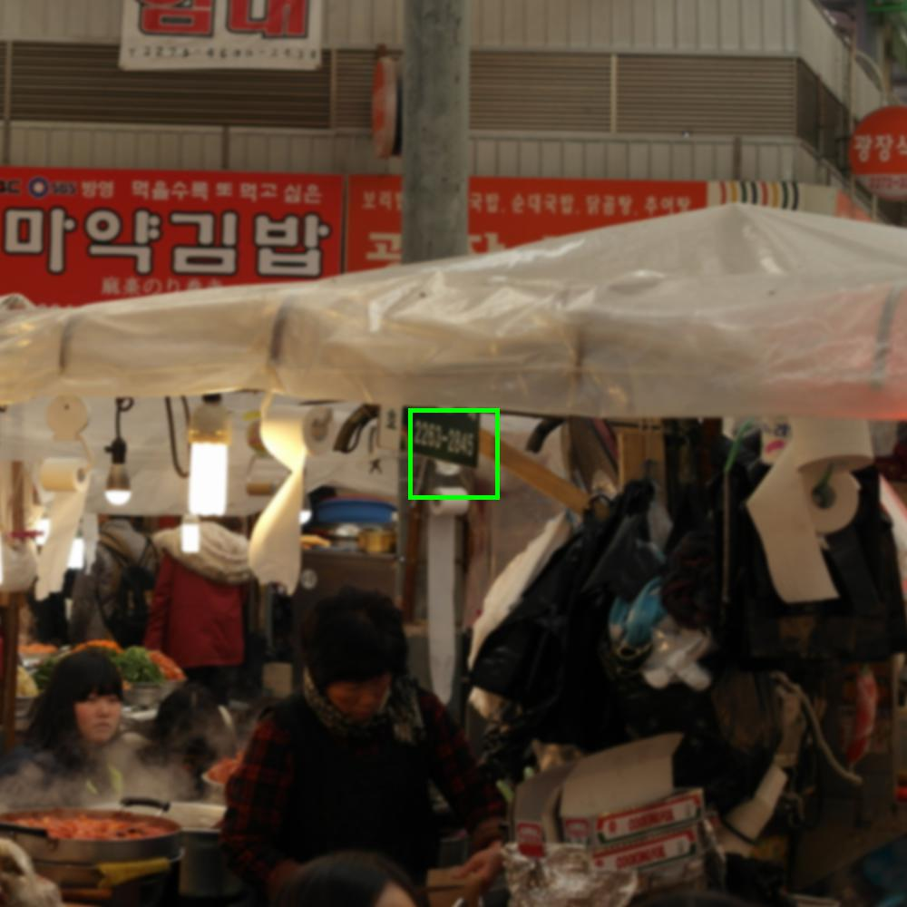
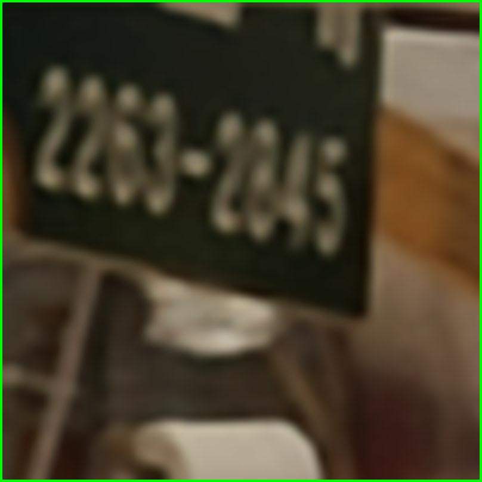

# Run RDSR
- Download github: https://github.com/kenpchu/RDSR-ReferenceDegradationSR.git
branch: main
- Download Datasets (DIV2KRK): 
https://www.wisdom.weizmann.ac.il/~vision/kernelgan/DIV2KRK_public.zip
- Download Datasets (DIV2K): 
https://www.wisdom.weizmann.ac.il/~vision/kernelgan/DIV2KRK_public.zip
- Environment setting:  env/RDSR.yml (anaconda environment setting file) 
Rebuild environment command: conda env create -f RDSR.yml
- For best performance of RDSR, check RDSR/run_rdsr_cfg.sh
  - isotropic kernel x2: python train_rdsr_disc_v2.py --cfg/config_rdsr_x2_iso.json  
  - anisotropic kernel x2: python train_rdsr_disc_v83.py --cfg/config_rdsr_x2_aniso.json 
  - isotropic kernel x4: python train_rdsr_disc_v44.py --cfg/config_rdsr_x4_iso.json 
  - anisotropic kernel x4: python train_rdsr_disc_v43.py --cfg/config_rdsr_x4_aniso.json
- Important Options of RDSR: (example: config_rdsr_x2_iso.json)
  - input image path:  "datasets_dir": "../../datasets" & "target_dir": "DIV2KRK/lr_x2"
  - input image ground truth path:  "datasets_dir": "../../datasets" & "ref_dir": "DIV2K/DIV2K_train_HR"
  - reference image path:  "datasets_dir": "../../datasets" & "target_dir": "DIV2KRK/gt"
  - reference count: "ref_count": 5
  - iterations of downsampling: "train_iters": 3000
  - iterations of encoder L->H for each reference image: "train_encoder_iters": 500,  500x5 = 2500
  - iterations of upscaler for each reference image: "train_sr_iters": 500, 500x5 = 2500
  - Learning rate of downsampling network: "lr_dn": 0.002
  - Learning rate of upscaler network: "lr_up": 1e-05
  - Learning rate of encoder network: "lr_en": 5e-05
  - Learning rate of upsampling discriminator network: "lr_up_disc": 1e-05
  - Pretrained model path: "pretrained_baseline_path": "pre-trained_model/model_x2_iso_600.pt"
  - Select range from datasets :  "target_ind": 0 & "target_count": 100 (run from images from 1 to 100)

# Run RDSR
RDSR: use isotropic kernel x2 as an example, py with green color, function with blue color.
- **RDSR/trainer/rdsrdisctrainerv20.py**: 
  - _start_train_dn_: train downsampling network (Initial Phase)
  - _start_train_up_: train encoder L->H and upsampling network (Fin-tune Phase)	
  - _train_up_discriminator_: train discriminator of upsampling
  - _train_upsample_: target branch & reference branch training
  - _cal_whole_image_loss_: criteria for final result (paper 4.1)
- **RDSR/loss/loss.py** 
  - _CharbonnierLoss_:  one of cycle consistency loss (similar to L1 loss)
  - _VGG_:  one of cycle consistency loss (perception loss)
  - _GANLoss_:  GAN loss for  upsampling discriminator 
- **RDSR/networks** (directory)
  - _downsample.py_: network architecture of downsampling network
  - _upsample.py_: network architecture of upsampling network
- **RDSR/utils** (directory)
  - _util.py_: define utility functions.
- **RDSR/data/data.py**: data loader for RDSR, includes the target branch & reference branch
- **RDSR/tsne_utils.py**: utils about visualizing degradation representation.

# Run Reference Add-on module

- For best performance of Ref. add-on, check **RefAddon/run_refaddon_cfg.sh**
  - DualSR + Ref. add-on x2: python main1.py --cfg/config_addon_div2k_x2.json  
  - DualSR + Ref. add-on x4: python main1_v21.py --cfg/config_addon_div2k_x4.json
- Important Options of Ref. Add-on: (example: config_addon_div2k_x4.json)
  - input image path:  "input_dir": "../../datasets/DIV2K/DIV2K_train_LR_unknown/X4"
  - input image ground truth path:  "gt_dir": "../../datasets/DIV2K/DIV2K_train_HR"
  - reference image path:  "ref_dir": "../../datasets/DIV2KRK/gt"
  - reference count: "ref_count": 3
  - total training iterations: "num_iters": 3000
  - iteration to start ref. add-on training: "start_dr_iter": 800 & "start_min_loss_iter": 800
  - iteration to stop ref. add-on training: "ref_stop_iters": 1500
  - Learning rate of downsampling network: "lr_G_DN": 0.0002
  - Learning rate of upsampling network: "lr_G_UP": 0.001
  - Learning rate of downsampling discriminator network: "lr_D_DN": 0.0002
  - Patch crop size: "input_crop_size": 128
  - Batch size: "batch_size": 2
  - Scaling factor: "scale_factor": 4 & "scale_factor_downsampler": 0.25
  - Select range from datasets :  "target_ind": 0 & "target_count": 100 (run from images from 1 to 100)

# Codes of Reference Add-on module
Reference Add-on: use DIV2K x2 as an example, py with green color, function with blue color
- **RefAddon/DualSR1.py**: 
  - _train_: train overall process 
  - _train_G_: train Generator, includes target branch and reference branch
  - _train_D_: train Discriminator 
  - _eval_whole_img_: criteria for final result (paper 4.1)
- **RefAddon/loss.py**:
  - _VGG_:  one of cycle consistency loss (perception loss)
  - _GANLoss_:  GAN loss for  upsampling discriminator 
- **RefAddon/data1.py**: dataloader for the target branch & reference branch.
- **RefAddon/network.py**: network architecture of downsampling **Generator_DN**,  upsampling **Generator_UP** and discriminator network **Discriminator_DN**.
- **RefAddon/util.py**: define utility functions.

# Duplicate DualSR Result:
- Git clone DualSR code from https://github.com/memad73/DualSR.git
- Run x2 setting: apply patch from DualSR_run_patch/x2/0001-DualSR_run_patch.patch
  - git apply 0001-DualSR_run_patch.patch
- Run x4 setting: apply patch from DualSR_run_patch/x4/0001-DualSRx4_run_patch.patch
  - git apply 0001-DualSRx4_run_patch.patch
- Run “run.sh”

# Result Combine Tools:
- report_tools/RDSR_result_combine.py: combine RDSR csv results, input path of “eval_*.csv” (refer to line 108 in func: main1)
- report_tools/RefAddon_result_combine.py: combine reference add-on csv results, input path of “eval_*.csv” (refer to line 91 in func: main)

# Visual Results
------------------------------------
| Mode | Scale | Datasets | Img No. |
| :----: | :----: | :----: | :----: |
| RDSR-iso | x2 | DIV2KRK | im_4 |

| Ref. Imgs | LR | Ground Truth | RDSR | DASR | DualSR | RZSR | Bicubic |
| :----:| :----: | :----: | :----: | :----: | :----: | :----: | :----: |
|  |  ||| | |||

------------------------------------
| Mode | Scale | Datasets | Img No. |
| :----: | :----: | :----: | :----: |
| RDSR-iso | x2 | DIV2KRK | im_13 |

| Ref. Imgs | LR | Ground Truth | RDSR | DASR | DualSR | RZSR | Bicubic |
| :----:| :----: | :----: | :----: | :----: | :----: | :----: | :----: |
|  |  ||| | |||

------------------------------------
| Mode | Scale | Datasets | Img No. |
| :----: | :----: | :----: | :----: |
| RDSR-iso | x2 | DIV2KRK | im_17 |

| Ref. Imgs | LR | Ground Truth | RDSR | DASR | DualSR | RZSR | Bicubic |
| :----:| :----: | :----: | :----: | :----: | :----: | :----: | :----: |
|  |  ||| | |||

------------------------------------
| Mode | Scale | Datasets | Img No. |
| :----: | :----: | :----: | :----: |
| RDSR-iso | x2 | DIV2KRK | im_31 |

| Ref. Imgs | LR | Ground Truth | RDSR | DASR | DualSR | RZSR | Bicubic |
| :----:| :----: | :----: | :----: | :----: | :----: | :----: | :----: |
|  |  ||| | |||

------------------------------------
| Mode | Scale | Datasets | Img No. |
| :----: | :----: | :----: | :----: |
| RDSR-iso | x2 | DIV2KRK | im_86 |

| Ref. Imgs | LR | Ground Truth | RDSR | DASR | DualSR | RZSR | Bicubic |
| :----:| :----: | :----: | :----: | :----: | :----: | :----: | :----: |
|  |  ||| | |||

------------------------------------
| Mode | Scale | Datasets | Img No. |
| :----: | :----: | :----: | :----: |
| RDSR-iso | x2 | DIV2KRK | im_94 |

| Ref. Imgs | LR | Ground Truth | RDSR | DASR | DualSR | RZSR | Bicubic |
| :----:| :----: | :----: | :----: | :----: | :----: | :----: | :----: |
|  |  ||| | |||

------------------------------------
| Mode | Scale | Datasets | Img No. |
| :----: | :----: | :----: | :----: |
| RDSR-iso | x2 | DIV2KRK | im_45 |

| Ref. Imgs | LR | Ground Truth | RDSR | DASR | Bicubic |
| :----:| :----: | :----: | :----: | :----: | :----: |
|  |  ||| ||

------------------------------------
| Mode | Scale | Datasets | Img No. |
| :----: | :----: | :----: | :----: |
| RDSR-aniso | x2 | DIV2KRK | im_8 |

| Ref. Imgs | LR | Ground Truth | RDSR | DASR | DualSR | RZSR | Bicubic |
| :----:| :----: | :----: | :----: | :----: | :----: | :----: | :----: |
|  |  ||| | |||

------------------------------------
| Mode | Scale | Datasets | Img No. |
| :----: | :----: | :----: | :----: |
| RDSR-aniso | x2 | DIV2KRK | im_14 |

| Ref. Imgs | LR | Ground Truth | RDSR | DASR | DualSR | RZSR | Bicubic |
| :----:| :----: | :----: | :----: | :----: | :----: | :----: | :----: |
|  |  ||| | |||

------------------------------------
| Mode | Scale | Datasets | Img No. |
| :----: | :----: | :----: | :----: |
| RDSR-aniso | x2 | DIV2KRK | im_51 |

| Ref. Imgs | LR | Ground Truth | RDSR | DASR | DualSR | RZSR | Bicubic |
| :----:| :----: | :----: | :----: | :----: | :----: | :----: | :----: |
|  |  ||| | |||

------------------------------------
| Mode | Scale | Datasets | Img No. |
| :----: | :----: | :----: | :----: |
| RDSR-iso | x4 | DIV2KRK | im_23 |

| Ref. Imgs | LR | Ground Truth | RDSR | DASR | Bicubic |
| :----:| :----: | :----: | :----: | :----: | :----: |
|  |  |||||

------------------------------------
| Mode | Scale | Datasets | Img No. |
| :----: | :----: | :----: | :----: |
| RDSR-iso | x4 | DIV2KRK | im_96 |

| Ref. Imgs | LR | Ground Truth | RDSR | DASR | Bicubic |
| :----:| :----: | :----: | :----: | :----: | :----: |
|  |  |||||

------------------------------------
| Mode | Scale | Datasets | Img No. |
| :----: | :----: | :----: | :----: |
| RDSR-iso | x4 | DIV2KRK | im_98 |

| Ref. Imgs | LR | Ground Truth | RDSR | DASR | Bicubic |
| :----:| :----: | :----: | :----: | :----: | :----: |
|  |  |||||

------------------------------------
| Mode | Scale | Datasets | Img No. |
| :----: | :----: | :----: | :----: |
| RDSR-aniso | x4 | DIV2KRK | im_11 |

| Ref. Imgs | LR | Ground Truth | RDSR | DASR | Bicubic |
| :----:| :----: | :----: | :----: | :----: | :----: |
|  |  |||||

------------------------------------
| Mode | Scale | Datasets | Img No. |
| :----: | :----: | :----: | :----: |
| RDSR-aniso | x4 | DIV2KRK | im_44 |

| Ref. Imgs | LR | Ground Truth | RDSR | DASR | Bicubic |
| :----:| :----: | :----: | :----: | :----: | :----: |
|  |  |||||

------------------------------------
| Mode | Scale | Datasets | Img No. |
| :----: | :----: | :----: | :----: |
| RDSR-aniso | x4 | DIV2KRK | im_78 |

| Ref. Imgs | LR | Ground Truth | RDSR | DASR | Bicubic |
| :----:| :----: | :----: | :----: | :----: | :----: |
|  |  |||||

------------------------------------
| Mode | Scale | Datasets | Img No. |
| :----: | :----: | :----: | :----: |
| Ref. Add-on | x2 | DIV2KRK | im_60 |

| Ref. Imgs | LR | Ground Truth | RDSR | DualSR | Bicubic |
| :----:| :----: | :----: | :----: | :----: | :----: |
|  |  |||||

------------------------------------
| Mode | Scale | Datasets | Img No. |
| :----: | :----: | :----: | :----: |
| Ref. Add-on | x2 | DIV2KRK | im_6 |

| Ref. Imgs | LR | Ground Truth | RDSR | DualSR | Bicubic |
| :----:| :----: | :----: | :----: | :----: | :----: |
|  |  |||||

------------------------------------
| Mode | Scale | Datasets | Img No. |
| :----: | :----: | :----: | :----: |
| Ref. Add-on | x2 | DIV2KRK | im_65 |

| Ref. Imgs | LR | Ground Truth | RDSR | DualSR | Bicubic |
| :----:| :----: | :----: | :----: | :----: | :----: |
|  |  |||||

------------------------------------
| Mode | Scale | Datasets | Img No. |
| :----: | :----: | :----: | :----: |
| Ref. Add-on | x2 | DIV2KRK | im_99 |

| Ref. Imgs | LR | Ground Truth | RDSR | DualSR | Bicubic |
| :----:| :----: | :----: | :----: | :----: | :----: |
|  |  |||||

------------------------------------
| Mode | Scale | Datasets | Img No. |
| :----: | :----: | :----: | :----: |
| Ref. Add-on | x2 | DIV2K | 0125 |

| Ref. Imgs | LR | Ground Truth | RDSR | DualSR | Bicubic |
| :----:| :----: | :----: | :----: | :----: | :----: |
|  |  |||||

------------------------------------
| Mode | Scale | Datasets | Img No. |
| :----: | :----: | :----: | :----: |
| Ref. Add-on | x2 | DIV2K | 0572 |

| Ref. Imgs | LR | Ground Truth | RDSR | DualSR | Bicubic |
| :----:| :----: | :----: | :----: | :----: | :----: |
|  |  |||||

------------------------------------
| Mode | Scale | Datasets | Img No. |
| :----: | :----: | :----: | :----: |
| Ref. Add-on | x4 | DIV2KRK | im_33 |

| Ref. Imgs | LR | Ground Truth | RDSR | DualSR | Bicubic |
| :----:| :----: | :----: | :----: | :----: | :----: |
|  |  |||||

------------------------------------
| Mode | Scale | Datasets | Img No. |
| :----: | :----: | :----: | :----: |
| Ref. Add-on | x4 | DIV2KRK | im_54 |

| Ref. Imgs | LR | Ground Truth | RDSR | DualSR | Bicubic |
| :----:| :----: | :----: | :----: | :----: | :----: |
|  |  |||||

------------------------------------
| Mode | Scale | Datasets | Img No. |
| :----: | :----: | :----: | :----: |
| Ref. Add-on | x4 | DIV2KRK | im_80 |

| Ref. Imgs | LR | Ground Truth | RDSR | DualSR | Bicubic |
| :----:| :----: | :----: | :----: | :----: | :----: |
|  |  |||||

------------------------------------

# Acknowledgement
The code is built on [DualSR](https://github.com/memad73/DualSR) & [DASR](https://github.com/The-Learning-And-Vision-Atelier-LAVA/DASR). We thank the authors for sharing the codes.

